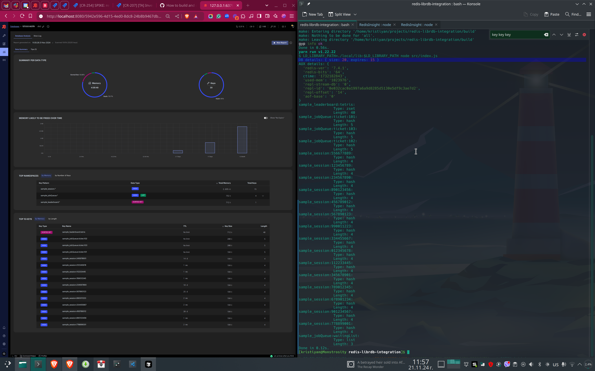

# Redis RDB Parser Node.js Addon

A Node.js native addon/wrapper that parses Redis RDB files using the librdb library. This addon provides a bridge between Node.js applications and Redis dump files, allowing you to extract and analyze Redis data directly.

Dump files are used for the sake of simplicity, since this started as a spike. The librdb library does support streaming parsing, so this could be easily extended to work with large RDB files or with Redis instances directly as it support [some auth options](https://github.com/redis/librdb?tab=readme-ov-file#rdb-cli-usage)

## What is librdb?

[librdb](https://github.com/redis/librdb) is the official Redis RDB parser library. It's a C library that provides a low-level interface for parsing Redis RDB dump files. Key features of librdb include:

- Direct parsing of Redis RDB files without requiring a Redis server
- Support for all Redis data types and encodings
- Streaming parser design for memory efficiency
- Official support from the Redis team
- Used in Redis tools like redis-memory-analyzer

The library allows developers to:
- Read and analyze Redis dump files
- Extract metadata and statistics
- Access Redis data structures
- Build tools for Redis data migration and analysis

This Node.js addon wraps librdb to make its functionality available to Node.js applications, providing a JavaScript-friendly interface for working with Redis dump files.

## Features

- Parse Redis RDB dump files
- Extract Redis metadata (version, memory usage, etc.)
- Get database statistics
- Access all Redis keys and their values
- Retrieve data type information for each key
- Support for all Redis data types:
  - Strings
  - Lists
  - Sets
  - Sorted Sets (ZSets)
  - Hashes
  - Streams

## Prerequisites

- Node.js (v12 or higher)
- node-gyp
- C++ compiler (GCC, Clang, or MSVC)
- librdb library

## Installation

1. Clone the repository:
   ```bash
   git clone https://github.com/yourusername/redis-rdb-parser
   cd redis-rdb-parser
   ```

2. Build librdb:
   ```bash
   ./scripts/build-librdb.sh
   ```

3. Install dependencies and build the addon:
   ```bash
   npm install
   ```

## Usage

```javascript
const addon = require('./build/Release/addon.node');

// Constants for accessing different sections
const DB_SIZE_KEY = '__dbsize__';
const AUX_FIELD_KEY = '__aux__';
const TYPES_KEY = '__types__';

// Redis data type mapping
const TYPE_NAMES = {
    0: 'string',
    1: 'list',
    2: 'set',
    3: 'zset',
    4: 'hash',
    6: 'stream'
};

try {
    // Parse the RDB file
    const result = addon.parseRDB('./dump.rdb');
    const parsed = JSON.parse(result);

    // Process each section of the data
    parsed.forEach(obj => {
        if (obj[DB_SIZE_KEY]) {
            console.log('Database Stats:', obj[DB_SIZE_KEY]);
        } else if (obj[AUX_FIELD_KEY]) {
            console.log('Redis Info:', obj[AUX_FIELD_KEY]);
        }
    });

    // Access key information
    const keyLengths = [];
    Object.entries(data).forEach(([key, value]) => {
        if (key !== TYPES_KEY) {
            const type = TYPE_NAMES[data[TYPES_KEY][key]];
            keyLengths.push({
                key: key,
                type: type,
                length: Array.isArray(value) ? value.length :
                       typeof value === 'string' ? value.length :
                       value.entries ? value.entries.length :
                       Object.keys(value).length,
            });
        }
    });
} catch (error) {
    console.error('Error parsing RDB file:', error);
}
```

## Output Format

The addon returns a JSON string containing an array of objects:

```json
[
    {
        "__aux__": {
            "redis-ver": "7.4.1",
            "redis-bits": "64",
            "used-mem": "2266568",
            "repl-stream-db": "0",
            "repl-id": "8371b4fb1155b205f1f1539b8c2e531f6d1f2847",
            "repl-offset": "0",
            "aof-base": "0"
        }
    },
    {
        "__dbsize__": {
            "size": 13,
            "expires": 0
        }
    },
    {
        "key1": "value1",
        "list_key": ["item1", "item2"],
        "set_key": ["member1", "member2"],
        "hash_key": {
            "field1": "value1",
            "field2": "value2"
        }
    },
    {
        "__types__": {
            "key1": 0,
            "list_key": 1,
            "set_key": 2,
            "hash_key": 4
        }
    }
]
```

## Project Structure

```
.
├── src/
│   ├── addon.cpp        # Main C++ addon code
│   └── index.js         # JavaScript interface
├── build/              # Build output directory
├── local/              # Local dependencies
│   └── lib/            # librdb library files
├── binding.gyp         # Build configuration
└── package.json
```

## Technical Details

### C++ Addon Implementation

The addon uses N-API (Node-API) to create a bridge between Node.js and C++. Key components:

1. **RDB Parser Initialization**
   - Creates a parser instance
   - Configures parsing options
   - Sets up handlers for different data types

2. **Data Collection**
   - Collects Redis metadata
   - Gathers database statistics
   - Extracts key-value pairs
   - Records data types

3. **JSON Generation**
   - Formats data into structured JSON
   - Separates metadata from actual Redis data
   - Maintains type information

### Build Configuration

The project uses node-gyp with the following configuration:

```json
{
  "targets": [
    {
      "target_name": "addon",
      "sources": [ "src/addon.cpp" ],
      "include_dirs": [
        "<!@(node -p \"require('node-addon-api').include\")",
        "local/include"
      ],
      "libraries": [ "-L<(module_root_dir)/local/lib", "-lrdb" ]
    }
  ]
}
```



## Acknowledgments

- [librdb](https://github.com/redis/librdb) - The official Redis RDB parser library
- [Node-API](https://nodejs.org/api/n-api.html) - Node.js Native API
- [Redis](https://redis.io/) - The open source, in-memory data store